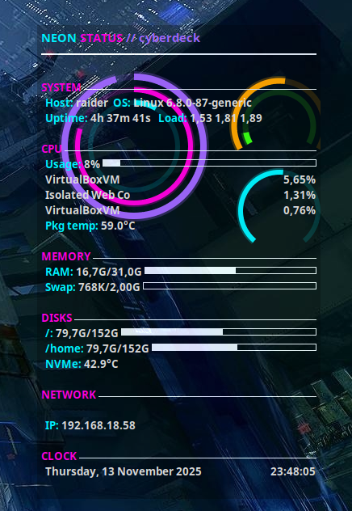

# Conky — Dark Neon Cyberpunk

Neon, cyberpunk-styled Conky setup with glowing rings (clock, CPU, RAM, disk) and a clean panel of system stats.



## Files
- `conky.conf` — main Conky config
- `rings.lua` — Cairo-powered neon rings
- `README.md` — this guide

## Install
```bash
# 1) Install conky with Lua/Cairo support
#   Arch     : sudo pacman -S conky
#   Ubuntu   : sudo apt install conky-all
#   Fedora   : sudo dnf install conky
#   FreeBSD  : pkg install conky

# 2) Create config folder
mkdir -p ~/.config/conky/conky_dark_neon_cyberpunk

# 3) Copy files
cp conky.conf rings.lua ~/.config/conky/conky_dark_neon_cyberpunk/

# 4) (Optional) Install a nice Nerd Font (for icons/ligatures)
# Use your distro's package or:
#   Arch: sudo pacman -S ttf-jetbrains-mono-nerd
#   Ubuntu: sudo apt install fonts-jetbrains-mono
# Or adjust the 'font' in conky.conf to DejaVu Sans Mono

# 5) Run
conky -q -c "$HOME/.config/conky/conky_dark_neon_cyberpunk/conky.conf" &

# 6) Autostart (i3 example)
#   Add to ~/.config/i3/config:
#   exec_always --no-startup-id conky -q -c ~/.config/conky/conky.conf
```

## Notes
- The theme uses a compositor-friendly **glass** window with alpha (own_window_argb_value=60).
- Rings require **Lua Cairo** support (provided by `conky-all` packages).
- GPU readouts use `nvidia-smi` if present (otherwise show blank).
- Network section auto-shows `eth0` and/or `wlan0` if they're up. Adjust interface names if needed.
- Weather line uses wttr.in; comment out if you prefer offline-only.

## Tweak Colors / Layout
- Edit `color1..color5` in `conky.config` to shift the neon palette.
- Move rings by changing the `(x,y)` positions in `rings.lua`. They’re anchored for a 320px-wide panel at top-right.

Enjoy your neon cyberdeck 🌃
